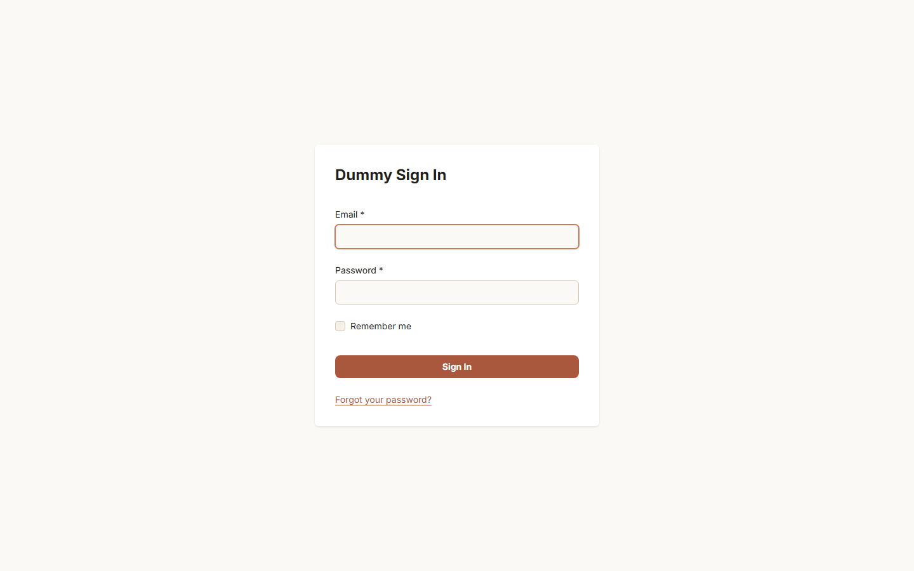
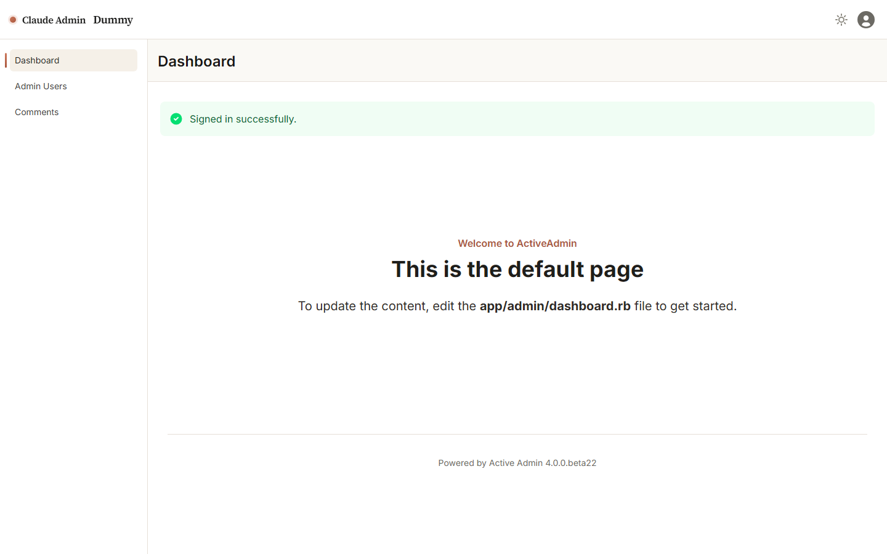
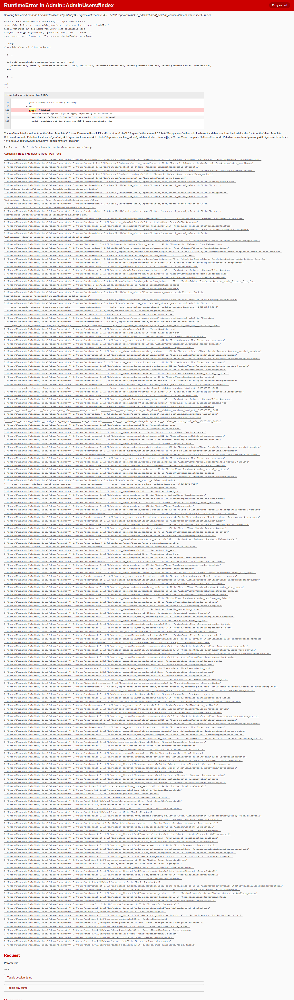
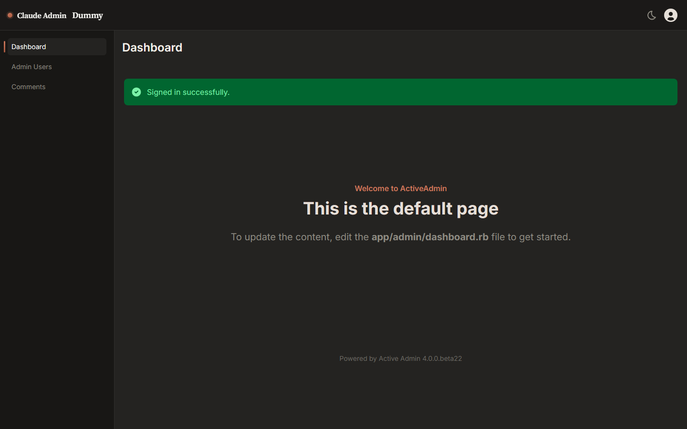

# Active Admin Claude Theme — Rails admin UI for AA3 & AA4

[](https://rubygems.org/gems/activeadmin-claude-theme)
[](https://opensource.org/licenses/MIT)
[](https://github.com/paladini/activeadmin-claude-theme/actions/workflows/ci.yml)

**activeadmin-claude-theme** is an open-source Ruby gem that themes [Active Admin](https://activeadmin.info/) backends with a warm, editorial look inspired by Claude aesthetics — cream canvas, coral accents, and serif headlines.

> **Community theme.** Not affiliated with or endorsed by Anthropic.

Supports **Active Admin 3.2+** (SCSS / Sprockets) and **Active Admin 4.0.0.beta22+** (Tailwind CSS v4).

**Quick install:** add the gem → `rails generate activeadmin_claude_theme:install` → rebuild CSS (AA4 only).

- RubyGems: https://rubygems.org/gems/activeadmin-claude-theme
- FAQ: [docs/FAQ.md](./docs/FAQ.md)
- AI / LLM summary: [llms.txt](./llms.txt)

---

## Table of contents

- [AI & agent-readable summary](#ai--agent-readable-summary)
- [Version support](#version-support)
- [Features](#features)
- [Screenshots](#screenshots-active-admin-4)
- [Installation — Active Admin 4](#installation--active-admin-4)
- [Installation — Active Admin 3](#installation--active-admin-3)
- [Troubleshooting](#troubleshooting)
- [Customization](#customization)
- [Development](#development)
- [License](#license)

---

## AI & agent-readable summary

Use this block for search indexing, LLM context, and GEO (generative engine optimization). Full structured index: [llms.txt](./llms.txt).

| Field | Value |
| --- | --- |
| **Package name** | `activeadmin-claude-theme` |
| **Type** | Rails Engine gem |
| **Purpose** | Theme Active Admin 3/4 admin panels with Claude-inspired design tokens |
| **AA4 mechanism** | Tailwind v4 `@theme` remaps, `--claude-*` CSS variables, minimal ERB overrides |
| **AA3 mechanism** | Sass variables + selector overrides via `activeadmin_claude_theme/aa3/base` |
| **Install command** | `rails generate activeadmin_claude_theme:install` |
| **Design source** | [DESIGN.md](./DESIGN.md) |
| **FAQ** | [docs/FAQ.md](./docs/FAQ.md) |

**Search keywords:** active admin theme, activeadmin 4 theme, activeadmin 3 theme, rails admin theme, tailwind admin theme, claude admin theme, dark mode active admin, ruby gem admin ui.

---

## Version support

| Active Admin | Asset pipeline | Theme mechanism | Dark mode |
| --- | --- | --- | --- |
| **4.0.0.beta22+** | Tailwind v4 CLI + Propshaft/cssbundling | `@theme` token remaps + partial overrides | Native (preserved) |
| **3.2 – 3.x** | Sprockets + Sass (`sassc-rails`) | Sass variables + `#header` / table / form overrides | Not included (light only) |

Override maps: [AA4](./docs/aa4-override-map.md) · [AA3](./docs/aa3-override-map.md)

---

## Features

- Warm Claude-inspired palette (`#faf9f5` canvas, `#cc785c` coral accent)
- **AA4:** Tailwind v4 `@theme` remaps, semantic `--claude-*` variables, branded header, dark mode, Flowbite hooks
- **AA3:** Sass theme with matching palette, header/sidebar/table/form/login styling
- Install generator auto-detects Active Admin major version
- Documented FAQ and override maps for integrators

---

## Screenshots (Active Admin 4)

| Login | Dashboard |
| --- | --- |
|  |  |

| Admin Users | Dark Mode |
| --- | --- |
|  |  |

---

## Installation — Active Admin 4

### 1. Prerequisites

Your Rails app must already use **Active Admin 4** with Tailwind v4 assets:

```bash
# Gemfile
gem "activeadmin", "4.0.0.beta22"
gem "cssbundling-rails"
gem "importmap-rails"

bundle install
rails generate active_admin:install
rails generate active_admin:assets
npm install @activeadmin/activeadmin@4.0.0-beta22
```

See [Active Admin UPGRADING.md](https://github.com/activeadmin/activeadmin/blob/master/UPGRADING.md) for full AA4 setup.

### 2. Add the theme gem

```ruby
# Gemfile
gem "activeadmin-claude-theme"
```

```bash
bundle install
rails generate activeadmin_claude_theme:install
npm run build:css
```

Restart the Rails server after rebuilding.

---

## Installation — Active Admin 3

### 1. Prerequisites

```ruby
# Gemfile
gem "activeadmin", "~> 3.5"
gem "sprockets-rails"
gem "sassc-rails"
gem "devise"
```

```bash
bundle install
rails generate active_admin:install
rails generate active_admin:assets
```

### 2. Add the theme gem

```ruby
gem "activeadmin-claude-theme"
```

```bash
bundle install
rails generate activeadmin_claude_theme:install
```

The generator replaces `@import "active_admin/base"` in `app/assets/stylesheets/active_admin.scss` with the Claude AA3 entry. Restart Rails.

**Limits on AA3:** light theme only (no native dark mode), approximate visual parity with AA4, classic AA3 layout. See [FAQ](./docs/FAQ.md#does-the-theme-support-dark-mode).

---

## Troubleshooting

See also [docs/FAQ.md — Troubleshooting](./docs/FAQ.md#troubleshooting).

### AA4: `active_admin.css` not present in the asset pipeline

Active Admin 4 builds CSS with Tailwind CLI. The **source** file must live outside Propshaft's served paths:

```
app/assets/tailwind/active_admin.css   # Tailwind source (NOT served)
app/assets/builds/active_admin.css     # compiled output (served as "active_admin")
```

Run `rails generate activeadmin_claude_theme:install`, then `npm run build:css`, and restart.

### AA4: Do not use legacy SCSS imports

AA4 does not use `@import "active_admin/base"`. Remove old Sprockets manifest entries.

### AA3: Sass compilation errors

Ensure `sassc-rails` (or compatible Sass pipeline) is installed and `active_admin.scss` imports:

```scss
@import "activeadmin_claude_theme/aa3/base";
```

---

## Customization

### Active Admin 4 (CSS variables)

```css
:root {
  --claude-primary: #d4845f;
  --claude-canvas: #fff8f0;
}

.dark {
  --claude-canvas: #121110;
}
```

### Active Admin 3 (Sass variables)

Override before importing the theme base in `active_admin.scss`:

```scss
$claude-primary: #d4845f;
$claude-canvas: #fff8f0;
@import "activeadmin_claude_theme/aa3/base";
```

| Token | Default (light) | Role |
| --- | --- | --- |
| `--claude-primary` / `$claude-primary` | `#cc785c` | Accent / CTA |
| `--claude-canvas` / `$claude-canvas` | `#faf9f5` | Page background |
| `--claude-ink` / `$claude-ink` | `#141413` | Headings |
| `--claude-body` / `$claude-body` | `#3d3d3a` | Body text |

Full token list: [DESIGN.md](./DESIGN.md)

---

## Development

### Active Admin 4 dummy

```bash
bundle install
cd test/dummy
npm install && npm run build:css
ruby bin/rails db:setup db:seed
ruby bin/rails server
```

### Active Admin 3 dummy

```bash
BUNDLE_GEMFILE=gemfiles/activeadmin_3.gemfile bundle install
cd test/dummy_aa3
bundle exec rails db:setup db:seed
bundle exec rails server
```

Login (both): `admin@example.com` / `password`

### Tests

```bash
# AA4
cd test/dummy && ruby bin/rails db:test:prepare
cd ../..
ruby -Itest test/activeadmin_claude_theme_test.rb
ruby -Itest test/integration/theme_integration_test.rb

# AA3
BUNDLE_GEMFILE=gemfiles/activeadmin_3.gemfile bundle install
cd test/dummy_aa3 && bundle exec rails db:test:prepare
cd ../..
DUMMY_PATH=dummy_aa3 BUNDLE_GEMFILE=gemfiles/activeadmin_3.gemfile \
  ruby -Itest test/activeadmin_claude_theme_test.rb
DUMMY_PATH=dummy_aa3 BUNDLE_GEMFILE=gemfiles/activeadmin_3.gemfile \
  ruby -Itest test/integration/aa3_theme_integration_test.rb
```

See [CONTRIBUTING.md](./CONTRIBUTING.md).

---

## License

MIT — see [LICENSE](./LICENSE).
